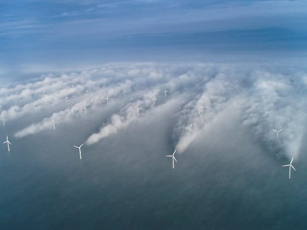

> Ветряки в марте 2011 года обеспечили 21 процент потребностей Испании в электричестве и впервые вышли на первое место среди источников электроэнергии в стране.

[Это][1] очень круто, конечно.

Картинко [отсюда][2].

[1]: http://lenta.ru/news/2011/03/31/wind/
[2]: http://www.popsci.com/technology/article/2010-01/wind-turbines-leave-clouds-and-energy-inefficiency-their-wake