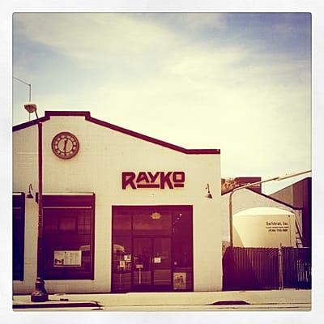
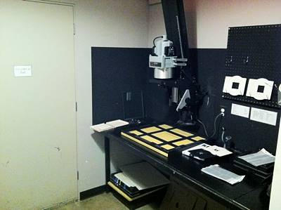
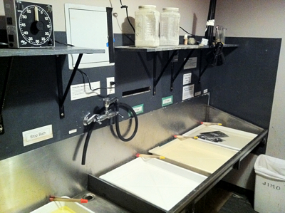

Договорился я, в итоге, только с [RayKo Photo Center](http://raykophoto.com/). У остальных или не было больше даркрума, или даркрум этот был для членов клуба, или же я просто не получил ответ. От RayKo ответ мне пришел уже в СФ, когда я не особо и надеялся. Пленок я взял всего несколько, да и те - первые, что попались под руку. Выглядит даркрум так:

И так:

Заплатил я что-то порядка $30 за 2 часа чистого времени в темной комнате (успел напечатать 4 фотки, еще штуки 4 были пробные или просто не получились). Промывка фоток и их сушка выполняется снаружи даркрума и на стоимость не влияет.

Это был очень клевый опыт (до этого я на больших увеличителях не печатал, да и в даркруме был только в своей ванной :). Если поеду еще, то непременно схожу к ним опять!