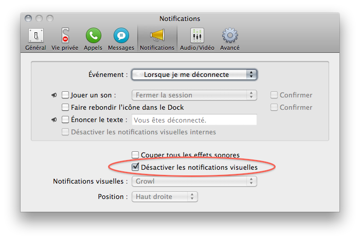

Никогда не меняйте смысл чекбокса на обратный, то есть когда "для того, чтобы что-то _включить_ надо что-то _выключить_" (или наоборот). Это же противоестественно :)

На картинке показан клинический случай. А из классических примеров вспоминается инвертирование чекбокса на страничках логина с "запомнить меня на этом компьютере" на "не запоминать меня на этом компьютере" (отмеченный чекбокс будет означать абсолютно противоположные вещи), хотя вместо того, чтобы инвертировать смысл, достаточно всего лишь проставить правильное дефолтное значение.

И еще внезапно выяснилось, что смена языка интерфейса, часто помогает посмотреть на вещи совсем под другим углом :)