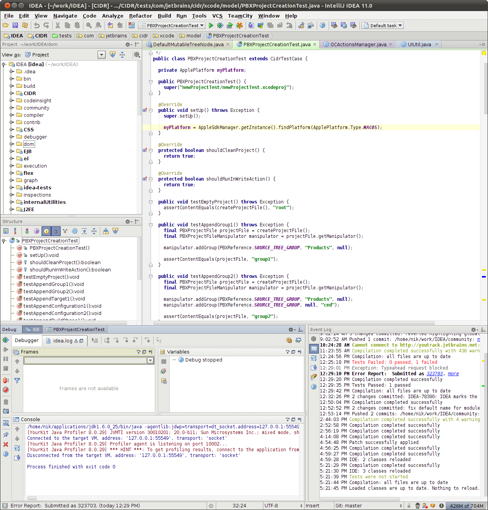

Особо горжусь тем, что мы с [Сережей Ильиным][1] в этом, крайнем для меня релизе, зафигачили новый кросс-платформенный UI:

И есть [чуть побольше][2] для сравнения (before/after).

[1]: http://iserge.tumblr.com/tagged/favorite
[2]: /images/idea11-ui.png
