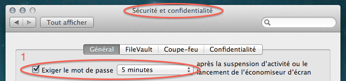
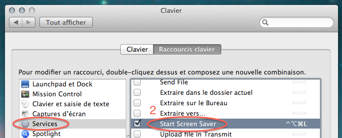

Оказывается, не все знают, как можно залочить мак с клавиатуры.

* Идем в настройки безопасности и ставим галочку напротив опции "Спрашивать пароль после активации скринсейвера":

* Потом идем в настройки клавиатуры, находим там группу шорткатов "Services" и вешаем шорткат на запуск скринсейвера:

Ну и напомню про самую клевую штуку — [повесить Spotlight на Caps Lock](http://blog.alexeypegov.com/note/use-caps-lock-as-spotlight-trigger)!