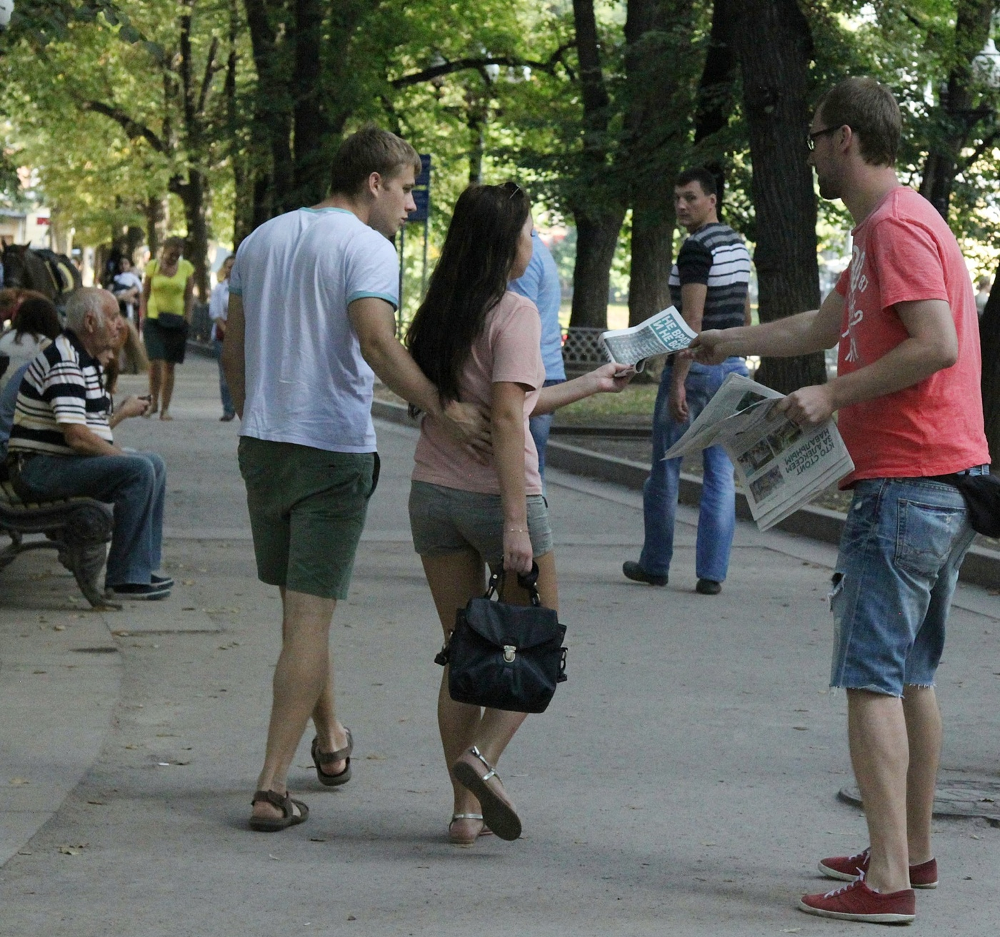

Эти выходные я провел в Москве и агитировал москвичей голосовать на Алексея Навального на выборах мэра и просто на эти выборы прийти, независимо от того, за какого кандидата они собираются отдать свой голос. Ниже краткий отчет и впечатления.

Я приехал в Москву утром в субботу и первым делом отправился на станцию метро Кунцевская, где находится квартира ребят, у которых я остановился (спасибо, Лехи, за компанию и спальное место, было очень душевно!), чтобы оставить вещи и позавтракать. После этого я поехал в штаб (Лялин, 22), где меня зарегистрировали, спросили чем я готов заниматься (всем) и предложили поучаствовать в раздаче газет в вагонах метро. Я согласился, однако первая группа должна была стартовать только в три, а на часах было начало первого, поэтому на мой вопрос о том, чем можно было бы заняться до метро, мне предложили поехать на куб на Тимирязевской, что я и сделал.

**Куб на Тимирязевской, 17.08, 13:00-17:30.**

Это был мой первый куб и первое за долгое время общение со множеством незнакомых людей, да еще и в чужом для меня городе. До этого я занимался чем-то подобным в старших классах школы (собирал подписи) и на первом курсе института (работал лето продавцом в компьютерном магазине), то есть почти 15 лет назад, поэтому немного волновался. Но я заранее для себя решил не отказываться ни от какой работы, которую мне предложат, и даже если бы надо было разгружать машины с листовками, я бы сделал это с удовольствием, а тут сразу предложили поехать на куб (а я очень хотел попасть почему-то именно на куб, правда и на супер тренинг перед этим планировал попасть, но не сложилось), поэтому я отбросил все сомнения и поехал искать куб на Тимирязевской.

Нашел я его быстро, познакомился с заявителем Леонидом и простоял на кубе весь день до его окончания (не бросать же то, что начал). На кубе, как через какое-то время выяснилось, кроме меня было еще 2 парня из Питера, девочка из Новомосковска и еще несколько человек, с которыми я познакомился, но пообщаться толком не успел, потому что почти все ребята уехали с куба раньше меня. Основной функцией на кубе является раздача агитационных материалов, а так же общение с населением, которое хочет узнать про Алексея или про его программу. На Тимирязевской мы раздавали предвыборную газету и приглашение на встречу с АН, который должен был выступать перед жильцами этого микрорайона в понедельник.

Скажу сразу, что от общения с людьми на этом кубе (еще до того, как я оказался на кубах в центре), у меня сложилось очень тягостное впечатление. Произошло это потому, что среди тех, кого я приглашал прийти на встречу или же просто на выборы, было очень много людей, которые на выборы эти идти не собирались по причине того, что "все без нас решено и идти на выборы смысла нет". Реально много людей, я не берусь оценивать процентно, но я помню, как был удивлен (хотя, сейчас думаю, что удивляться надо было на следующий день в центре, а не тогда в спальном районе). Было какое-то не очень большое количество явных сторонников Собянина (хозяйственник, что-то делает), некоторое количество противников Навального (по телевизору сказали, что он вор), однако достаточно много и сторонников, которые подходили и брали приглашения и газеты не только для себя, но и для того, что раскидать по ящикам в подъезде. Среди сторонников были люди совершенно разного возраста, и молодые и бабульки. Среди противников, мне показалось, какое-то количество людей не совсем адекватных (один раз у меня женщина взяла из рук газету и приглашение и подкинула в воздух, какое-то количество людей просто послало меня
на три буквы). Так же было и много просто игнорирующих.

Было и несколько забавных моментов. Например в какой-то момент ко мне подошел парень и начал задавать какие-то вопросы вроде "почему Навальный не отменил ни один конкурс на госзакупках больше 1 млрд? не говорит ли это о том, что он в теме и отменяет только мелкие контракты?" и тп, я с ним пообщался, потом он ушел, через какое-то время пришел снова, пообщался с кем-то еще и тех, кто был на кубе, а потом (sic!) взял газеты и приглашения и стал раздавать их вместе с нами :)
Где-то в пять почти все разошлись, мы с Леонидом разобрали куб и я поехал в центр поесть (только завтракал с утра) и выпить пива с ребятами, у которых остановился. По дороге понял, что сгорел и решил в вс пойти на куб во второй половине дня.

**Кубы на Тверском бульваре и у Патриарших прудов, 18.08.**

На следующий день я решил в штаб не ездить, а выбрать подходящий куб [на карте](http://cube.navalny.ru/) сам. В субботу я неплохо спалил себе шею, поэтому выбрал куб на Патриарших, который был заявлен с 16 до 20, а первую половину дня решил просто погулять по городу. В итоге прогулялся по Красной площади, по Тверской и далее по Тверскому бульвару, где случайно наткнулся на куб с девушкой Катей, которая была его заявителем и единственным участником. Ее куб заканчивался в 4, как раз когда начинался куб на Патриарших, я решил ее поддержать и предложил постоять с ней какое-то время, чему она оказалась очень рада. Люди, прогуливающиеся по бульвару разительно отличались от людей с Тимирязевской: они охотно брали газеты, высказывали поддержку Навальному и тп, поэтому я решил остаться на кубе до конца (черт знает, что там будет на Патриарших, а тут тенек и столько приятных людей :). Где-то в 16:00 за мной приехал всей семьей мой старый коллега по работе Кирилл (arki), я попрощался с Катей и поехал на Патриаршие.

На Патриарших было приблизительно так же, как и на бульваре. Единственное отличие было в том, что на кубе было много людей, поэтому через какое-то время нашими стараниями газету Навального читали практически все посетители небольшого сквера. Нас было так много, что в какой-то момент оказалось, что раздавать материалы можно только где-то у входов (их было несколько), иначе с большой вероятностью газета у людей уже была или бы они просто ее не взяли (игнор или противники). В итоге, я встал у одного из входов и достаточно успешно простоял там почти все время. Пообщаться во второй день получилось мало, потому что в центре, с одной стороны, было гораздо больше сторонников Навального (или людей, которые про него слышали и просто брали газету и шли по своим делам), или же непримиримых противников, которые говорили что-то вроде "ко мне и не пытайтесь подходить", людей же игнорирующих почти не было, очень многие собирались прийти на выборы (даже если голосуют не за Навального).
Резюмирую: я отлично провел эти выходные, повидался с друзьями, пообщался с людьми, погулял по Москве. Если у вас будет время и возможность, настоятельно советую съездить и принять участие—гарантирую вам множество эмоций, больше понимания того, чем и как живут люди (пусть даже и в столице), а так же возможность лично повлиять на то, что нас ждет впереди!

И фоточка напоследок:

Так победим!