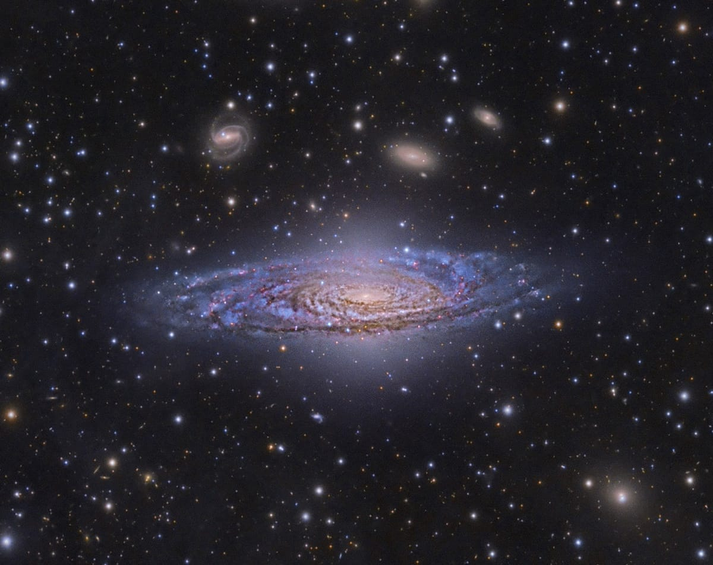

Тем временем, в созвездии Пегаса (!) наблюдается [вот такая красота](http://apod.nasa.gov/apod/ap141218.html)!
Ну или вот [про  2 года Curiosity на Марсе](http://www.nytimes.com/interactive/2014/12/09/science/space/curiosity-rover-28-months-on-mars.html?_r=2).