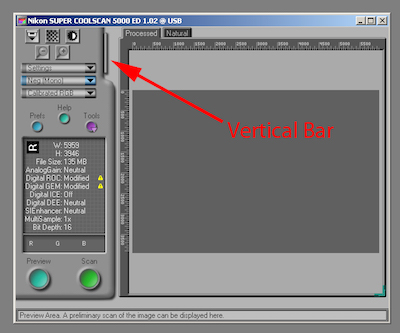

TWIMC

1. Лучшая программа для сканирования — ~~VueScan~~ NikonScan.
2. Последняя версия — 4.0.3, выпущена в конце нулевых и для запуска потребуется Windows Vista. Потанцевав с бубном можно стартануть под W7/64bit и вроде даже W10 (гуглите).
3. У меня макбук, поэтому запустил винду в виртуалке. Раньше их раздавали бесплатно вместе с IE, а теперь [там остались только W7/10][1], пришлось искать на торрентах. Вообще, купил бы, но не продают ведь.
4. Под маком у меня в VirtialBox сканер определился, но NikonScan его не увидел, шаманил-шаманил — ни в какую. Поставил [VMware Fusion][2] — и все сразу заработало.
5. При выходе из Fusion [у многих слетает bluetooth][3], починить это можно удалив Bluetooth PAN из _сетевых настроек мака_, по крайней мере, мне помогло. Вообще же, надо попробовать [Parallels][4].
6. Если вам так повезло и ваш адаптер поддерживает пакетную обработку кадров, то вот где она спрятана в интерфейсе NikonScan'а (картинка из интернетов):

[1]: https://developer.microsoft.com/en-us/microsoft-edge/tools/vms/
[2]: https://www.vmware.com/products/fusion.html
[3]: https://communities.vmware.com/thread/573761?start=30&tstart=0
[4]: https://www.parallels.com