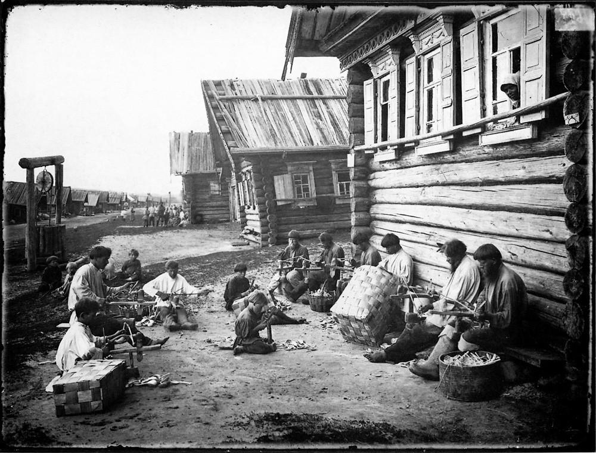

Я давно знаю про Прокудина-Горского и его работы ([фото](http://www.loc.gov/pictures/search/?st=grid&co=prok), [фильм](https://www.youtube.com/watch?v=QaeRj-ApktY)), а вот про [Максима Дмитриева](https://ru.wikipedia.org/wiki/%D0%94%D0%BC%D0%B8%D1%82%D1%80%D0%B8%D0%B5%D0%B2,_%D0%9C%D0%B0%D0%BA%D1%81%D0%B8%D0%BC_%D0%9F%D0%B5%D1%82%D1%80%D0%BE%D0%B2%D0%B8%D1%87) я, к стыду своему, не знал ничего. А, меж тем, его фотографии тем примечательны, что представляют из себя не портретную фотографию, доминировавшую в то время (даже у П-Г большинство снимков сделаны в жанре портрета), а сцены из повседневной жизни, о которых мы знаем преимущественно из исторической и художественной литературы, то есть чуть ли не первые [репортажные снимки России](https://cameralabs.org/9852-fotografii-tsarskoj-rossii-ot-osnovopolozhnika-fotozhurnalistiki-maksima-dmitrieva) того времени.