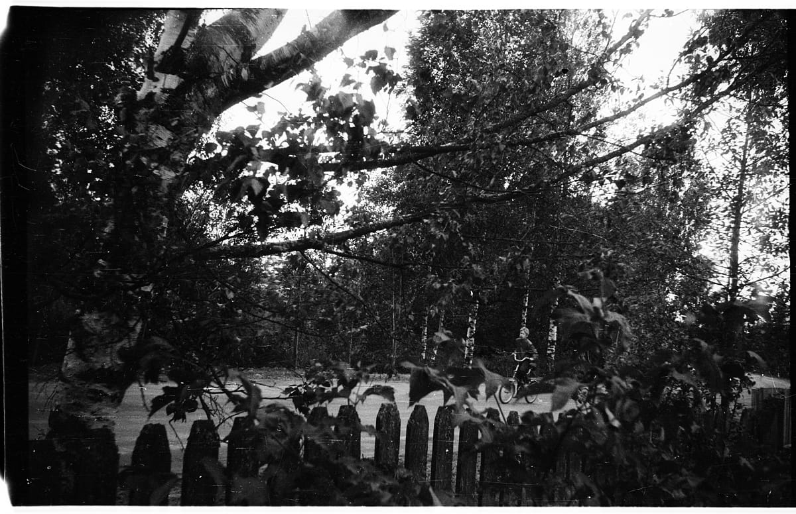
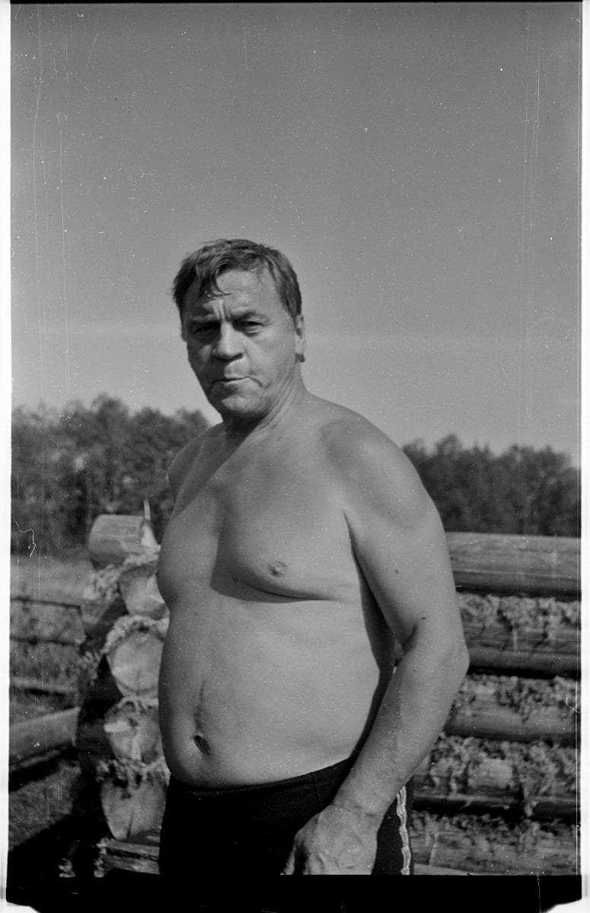

Вспомнил, что у меня где-то была фотографии мамы, полез копаться в негативах и нашел несколько старых пленок из 90-х. Точный год сказать не возьмусь, даже не знаю в один год это снято или нет, скорее всего в течение нескольких лет, но зато знаю точно, что проявлялось все мной лично в ванной, снималось на пленку Свема и на фотоаппарат [Смена 8М][1].

Несколько фотографий из деревни Шегрино, что в Новгородской области, где мы с братом проводили каждое лето с конца 80-х и до моего поступления в институт, то есть, до 1997-го.

Жилая часть нашего дома:

Подружка Настя и мой брат Фёдор (на фоне хозяйственной пристройки-сарая, в углу припаркован мой велосипед Салют):

Соседские девчонки Марина и Оля:

Брат куда-то топит на своей Каме:

Баба Дуся и мама. Фотография сделана в конце лета, когда я уже сидел в машине, на которой мы уезжали из деревни домой, а баба Дуся пришла нас проводить:

Папа где-то в процессе строительства бани:

Школьный поход в саблинские пещеры:

Кто-то и меня щелкнул в том же походе:

Такие дела.

[1]: https://ru.wikipedia.org/wiki/%D0%A1%D0%BC%D0%B5%D0%BD%D0%B0-8%D0%9C
