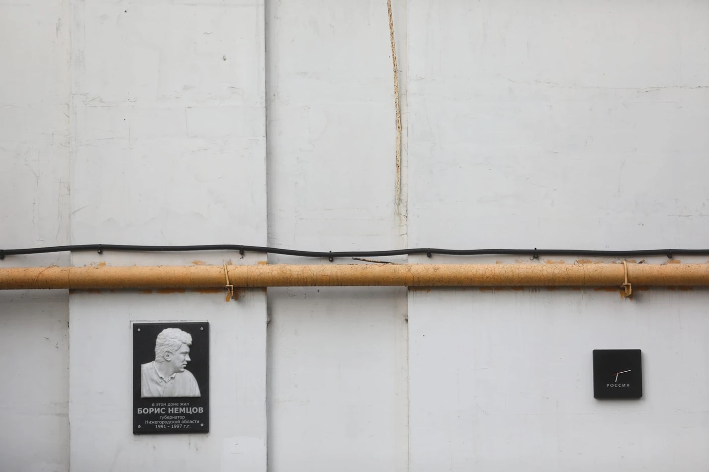

Понравилась инсталляция Константина Беньковича — [Часы "Россия"][1]:

> Нижний Новгород – место, навсегда связанное с Андреем Сахаровым, Борисом Немцовым и Ириной Славиной. Академик Андрей Сахаров – предвестник нового времени и новой страны - провел семь лет в ссылке в Горьком за борьбу с тоталитарной системой. Борис Немцов – первый Нижегородский губернатор, перспективный политик, символ перемен и надежд – был убит за свои убеждения. Ирина Славина - независимая журналистка, общественная деятельница – совершила акт самосожжения в ответ на беззаконие, оставив перед смертью запись в Фейсбуке: "В моей смерти прошу винить Российскую Федерацию". 
> Механизм часов, подобно России сегодня, движется назад, а не вперёд. В 1991 году, после распада СССР, было время надежд жить в стране победившей демократии с набором либеральных ценностей, со свободой слова, сменяемостью власти, честным судом и равенством всех перед законом. Спустя тридцать лет эти надежды, к сожалению, не оправдались.

Очень точно.

[1]: https://ru.benkovich.ru/%D1%87%D0%B0%D1%81%D1%8B%D1%80%D0%BE%D1%81%D1%81%D0%B8%D1%8F-1