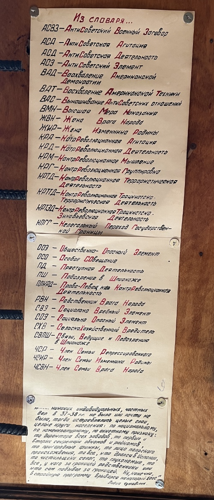

Хочу как-то зафиксировать свою позицию:

1. Убивать, пытать и унижать людей недопустимо, никак и никогда.
2. Никакого особого пути у России нет, Россия такая же страна, как и любая другая, развитие вне мировой экономики для России не даст никаких преимуществ, а только усугубит ее отставание по всем направлениям.
3. Для России нет никакой внешней угрозы, никто не хочет ее разделения. Для того, чтобы утверждать обратное, требуется больше доказательств, чем пропагандистские речи, транслируемые с экранов телевизоров.
4. Чем дольше человек находится у власти, тем больше его желание эту власть удержать и усилить всеми доступными способами, включая развязывание бессмысленной войны с братским народом. Сменяемость власти — механизм защиты от подобного.
5. Попытка переписать историю, оставляя в ней только победы, не поможет избежать ошибок в будущем, для этого требуется [осознать и принять прошлое][1], каким бы оно ни было.
6. Для того, чтобы сказать правду, не требуется никому затыкать рот, даже если вы с ним совершенно несогласны. Правда от этого не становится меньшей правдой. И наоборот, если вы лишаете слова всех вокруг — это повод задуматься, правда ли то, что вы говорите.

Как-то так.

Картинка выше из музея [Левашовской пустоши][2].

[1]: https://www.livelib.ru/book/1004970745-neudobnoe-proshloe-pamyat-o-gosudarstvennyh-prestupleniyah-v-rossii-i-drugih-stranah-nikolaj-epple
[2]: https://ru.wikipedia.org/wiki/%D0%9B%D0%B5%D0%B2%D0%B0%D1%88%D0%BE%D0%B2%D1%81%D0%BA%D0%BE%D0%B5_%D0%BC%D0%B5%D0%BC%D0%BE%D1%80%D0%B8%D0%B0%D0%BB%D1%8C%D0%BD%D0%BE%D0%B5_%D0%BA%D0%BB%D0%B0%D0%B4%D0%B1%D0%B8%D1%89%D0%B5