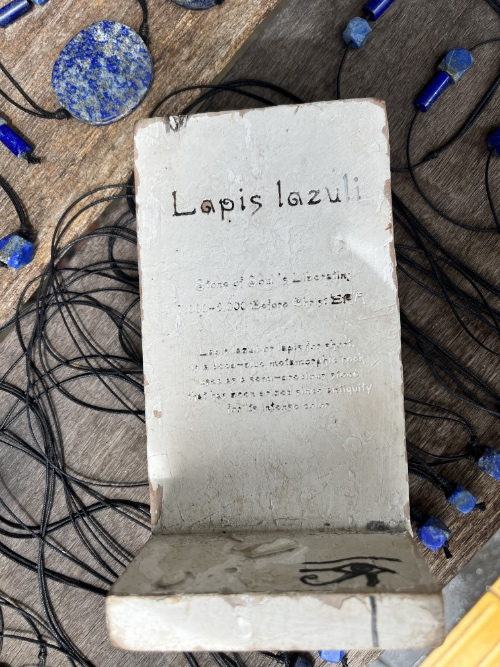

Гуляли сегодня по центру Пхукета, и я увидел приятные камушки на веревочках.

Купил себе. 

Заскринил даже что за камушек. Написано Lapis Lazuli. 

Купил, пошел, стал гуглить.

Оказалось, что камушек этот — [Афганский Лазурит][1].

А еще он (цитата по википедии):

> По имеющимся сведениям, нелегальная добыча и сбыт бадахшанского лазурита является вторым по величине источником дохода движения Талибан, а также причиной коррупции правительственных структур Афганистана.

Так что, похоже, я теперь еще и спонсор Талибана.

[1]: https://ru.wikipedia.org/wiki/%D0%90%D1%84%D0%B3%D0%B0%D0%BD%D1%81%D0%BA%D0%B8%D0%B9_%D0%BB%D0%B0%D0%B7%D1%83%D1%80%D0%B8%D1%82