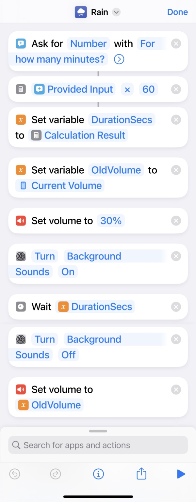

Оказалось, что уже несколько версий iOS умеет генерить разный фоновый шум:

Спрятано это все в **Settings &rarr; Accessibility &rarr; Audio/Visual &rarr; Background Sounds**.

Я по этому поводу запилил [шорткат](https://support.apple.com/ru-ru/guide/shortcuts/welcome/ios), который умеет включать этот шум на указанное время:

Включаю его перед сном или когда хочу чтобы ничего не отвлекало.

Вот он [файликом](https://www.icloud.com/shortcuts/9e6533272b5242a7ae0680bf3a1b7469).

Заодно выяснилось, что шорткаты в iOS не идеальны)