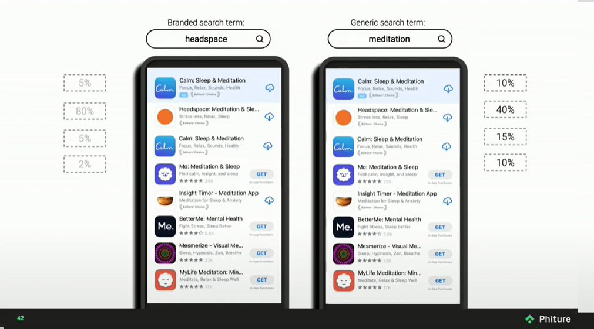

На всякий случай, это именно постмортем бизнеса, само приложение [доступно в апсторе][appstore] (и совершенно бесплатно), и я буду по мере возможностей его обновлять.

Итак, приложение, как мне кажется, получилось неплохое. Не идеальное, есть еще куда его пилить и улучшать, но классно уже то, что не имея никакого опыта ни в iOS, ни в Swift, ни в SwiftUI (ChatGPT не юзал, ахах), я его довел до релиза.

Однако, бизнеса из этого не вышло. Попробую коротко проговорить почему.

Я наивно предполагал, что "сделаю классную тулзу" и этого будет достаточно для успешной конкуренции с теми продуктами, что уже есть в сторе. Реальность же такова, что классного продукта недостаточно, более того, есть примеры, когда продукт может быть посредственный, но, тем не менее, его продают и продают хорошо. То есть, в первую очередь нужно понять как ты продукт будешь продавать. Почему? Потому что чтобы с кем-то конкурировать, нужно сперва оказаться в равных условиях, а условия изначально не равны — ты появляешься в сторе на позиции в самом конце списка, и тебя просто не найдут, а значит — не скачают, а значит — не купят. При этом, в основном зарабатывают приложения из первой тройки (см картинку), а даже если и больше, то находясь на 60-м месте ты заработаешь почти ничего. Можно давать рекламу (без рекламы нужна виральность или нетворк эффект, чего добиться можно, но точно не в сегменте таск-менеджеров), но для этого понимать свой сегмент и нужно уметь его таргетировать, иначе реклама будет дорогой и неэффективной — Агендус оказался ровно в такой ситуации, потому что совершенно непонятно как выделить "его пользователя" из общей массы.

В общем, я смог сделать продукт, но не смог его продать. С одной стороны это грустно, с другой — было крайне интересно и познавательно всем этим заниматься. А я набил шишек)

Если вдруг собираетесь что-то мутить в одно лицо, то есть очень хорошая, хотя и не очень свежая (но тем не менее, все еще очень релевантная) книжка — [Start small, stay small][ssss], которую крайне рекомендую.

Теперь еще совсем галопом из того, с чем столкнулся:

* Если с чем-то интегрироваться, то хорошо бы, чтобы это было бы апи, которое изначально подразумевает точку интеграции. В моем случае, Эпл сделал апи для событий и напоминаний, но в какой-то момент я обнаружил, что они на него в какой-то момент забили и перестали расширять, то есть, в приложениях самого эпла функциональности было (и будет) больше, чем я могу добавить в свое приложение. Понятно, что я могу выигрывать на другом, но, тем не менее, потенциально это лишает меня тех пользователей, которым эта (недоступная мне) функциональность важна.
* В добавок к предыдущему. Нужно реально воспринимать риски того, что если ты не делаешь что-то уникальное, это могут повторить. И это может повторить сама платформа, тогда твои конкурентные преимущества могут сильно просесть — в моем случае, на последнем WWDC, эпл анонсировала интеграцию напоминаний прямо в календарь, что было для меня не то, чтобы чем-то совершенно неожиданным, но все же неприятной новостью (к тому моменту я уже почти готов был сворачивать бизнес, и этот анонс только ускорил это решение).
* В ап сторе есть куча нюансов, причем совершенно неочевидных, которые знают только те, кто занимается продвижением там (ASO). Например, если вы выкладываете свое приложение, то при релизе эпл будет какое-то время вас "продвигать" (показывать вас выше в выдаче и тп), и этим надо попробовать воспользоваться по-максимуму, потому что любая такая "помощь" — это потенциально ваш шанс. Однако, это так же значит, что не нужно выкладывать приложение сразу на весь мир — потому что если оно не оптимизировано под конкретные рынки (например, не локализовано), то вы просто потеряете это продвижение и все (продвигаться оно будет, но пользователи на это продвижение не будут реагировать).
* ASO (app store optimization) — из того же ряда, что и SEO, только с еще меньшей возможностью на что-то повлиять, а самое главное — получить обратную связь быстро. То есть, там такая же схема — что-то поменяли, ждем две недели, смотрим как отразилось, повторяем. И если с SEO есть, по ощущениям, чуть больше возможности для маневра, то в ASO большинство маневров из не совсем легального поля, а значит есть риск получить бан. Тулзы для ASO — это такие очень специфичные штуки, которые просто ходят и фетчат выдачу из стора, и хотят за это дофига денег, потому что рассчитвают на компании с большими маркетингшовыми бюджетами. Кажется, можно наклепать на коленке скрипт, который пофетчит все это бесплатно и как-то сэкономить, но, опять же, это время и силы.
* Хорошо бы получить каких-то настоящих пользователей, чтобы они хоть как-то реагировали на продукт. Отсутствие реакции — намек на то, что что-то не так (а не на то, что вы сделали супер тул, ахаха). Мне очень не хватило фидбэка (да и пользователей воообще).
* Не стоит делать приложение платным сразу, особенно если вы пытаетесь выйти в очень активный сегмент. Стоит сделать что-то очень простое быстро, и набрать первых пользователей, после чего добавлять функциональность, реагируя на фидбэк, и искать свой Product-Market-Fit. В целом, я думаю, что мог зарелизиться раза в два быстрее, и как результат быстрее понять продолдать ли и тп. Однако, если вы делаете что-то специфичное, то бесплатные пользователи вам могут не принести никакой пользы, особенно если они вам нужны для виральности — нужно смотреть в каждом конкретном случае, есть ли вообще виральность в этом сегменте и будет ли она работать. 
* Хорошо бы быть активным в сети (личный бренд, бла бла бла) и иметь уже какую-то аудиторию. Все это занимает время. Но, что более важно, это должно приносить удовольствие, потому что для меня это не выглядит как ценность, я не кайфую от этого (наверное иначе бы у меня уже был бы уже и бренд), а заставить себя я не смог — вместо написания статей я садился что-то доделать в приложении.
* Делать скриншоты — гимор, но они супер важны и нужны, и поэтому хорошо бы подумать заранее как можно оптимизировать этот процесс. 
* Возможно, все еще следует уделять внимание SEO, то есть продвигать приложение вне стора, потому что в сторе возможностей для это кажется меньше (зависит от сегмента, но все же).
* Хорошая идея продвигать по специфичным комьюнити, например в reddit. Чаще комьюнити такую рекламу не любят, поэтому если это и разрешено, то часто с условиями, которые не всегда легко выполнить. Но тем не менее, такой возможностью не стоит пренебрегать.

Как-то так.

[appstore]: https://apps.apple.com/us/app/agendus-day-to-day-planner/id6475171944?ign-itscg=30200&ign-itsct=apps_box_badge&platform=iphone
[ssss]: https://startsmall.com/
