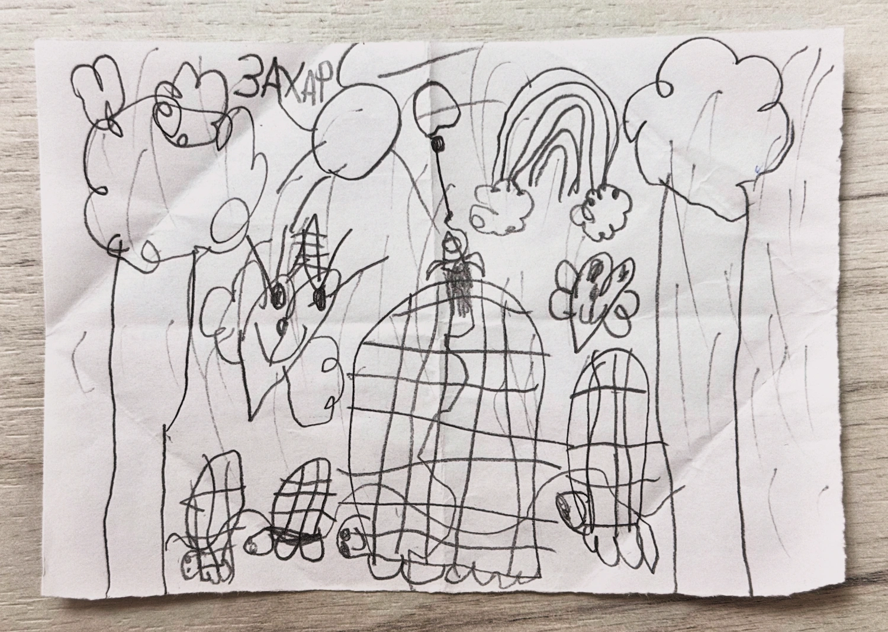
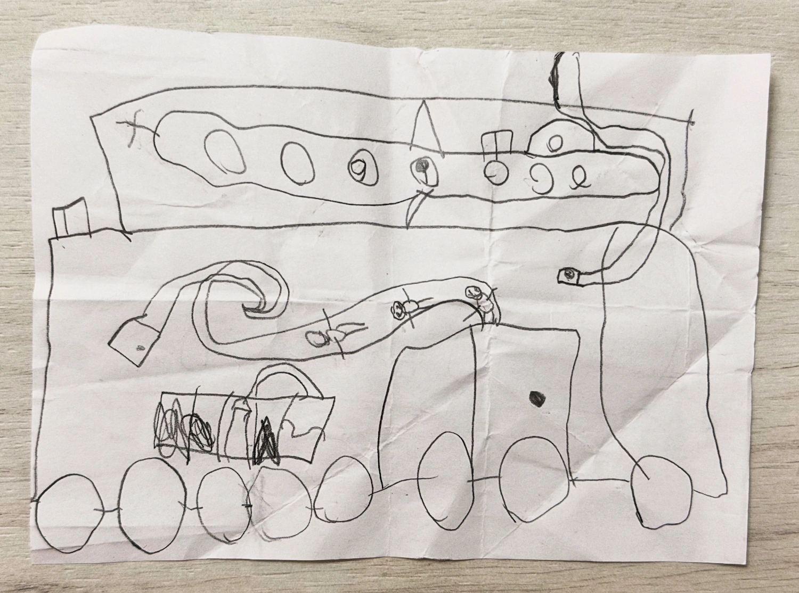
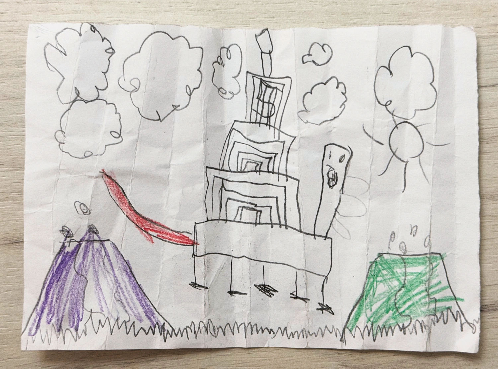

Захар рисует в садике на каких-то кусочках бумаги, которые потом складывает по многу раз, крутые картинки.

На одних идет дождь, светит радуга, ползают черепахи (самая большая — это сам Захар), есть мама и папа, а так же ракета (ищите):

На других люди летают по трубам (нет, Футураму он не смотрел) внутри трамвая, который перевозит подводную лодку:

На третьих извергаются вулканы и ходят прямоугольные пятиноги:

И так каждый день.
