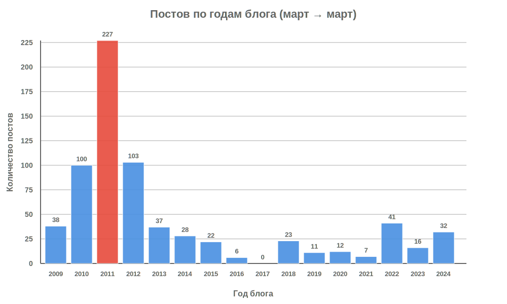

В этом году исполнилось 16 лет моему старшему сыну, а значит и этому блогу. Я попросил Клода собрать кое-какую статистику по этому поводу.

Первый пост — [Тимур Алексеевич](2009-03-24-тимур-алексеевич.html) — опубликован 24 марта 2009 года. С тех пор накопилось немало всего.

**В цифрах**

- **703 поста** за 16 лет (март 2009 – март 2025)
- **Средняя частота**: 44 поста в год, 0.12 поста в день
- **В 2011 графоманил**: 227 постов — почти каждые полтора дня!
- **А в 2017 забил**: 0 постов

**В тегах** (которые сейчас не видны)

1. **слушаю** — 203 раза
2. **саптрю** — 171 раз
3. **жизнь** — 66 раз
4. **разное** — 66 раз
5. **фотографирую** — 37 раз
6. **дизайн** — 36 раз
7. **софт** — 33 раза
8. **кино** — 30 раз
9. **цитата** — 25 раз
10. **юзабилити** — 20 раз

**Случайная выборка**

Вот пять случайных постов из архива:

- [субурбы](2012-05-26-субурбы.html) (2012)
- [Disney](2013-02-20-disney.html) (2013)  
- [Voice Over](2011-03-09-voice-over.html) (2011)
- [Optimism vs. Pessimism](2011-09-23-optimism-vs-pessimism.html) (2011)
- [Massive Attack - Paradise Circus (Zeds Dead Remix)](2011-10-23-massive-attack--paradise-circus-zeds-dead-remix.html) (2011)

Такие дела.

ps: несколько лет назад я удалил процентов 10 постов, потому что ссылки в них протухли и восстановить их оказалось невозможно. Сейчас подумал, что надо было обновить ссылки через [wayback machine](https://archive.org/), а не удалять посты.

pps: клод конечно посчитал все коряво, так что пришлось переделать, уверенности нет, но какая сейчас уверенность?
