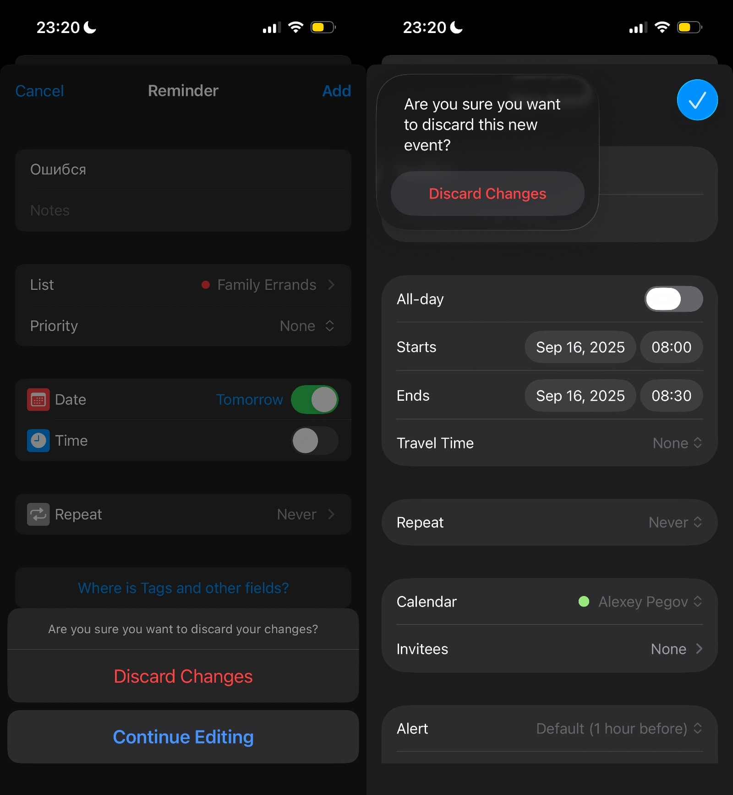

В своем [Агендусе][agendus] для создания события в календаре я использовал готовый UI. Увы, но для создания напоминания, такого готового UI не нашлось, поэтому мне пришлось написать его самому.

А сегодня я поставил iOS 26, и теперь экран создания напоминания отличается внешне от экрана создания события в календаре (ну, потому что эпл проапдейтила свой экран, а я на свой пока забил).

Да и хуй бы с ним, но...

И вот смотрю я на все эти округлости и прозрачности, и думаю, что все же очень плохо, когда тебе нужно что-то сделать, но сделать ты этого не можешь (читай: AI), и ты не знаешь, что еще может быть таким же хайповым... кроме... может быть... а что, если... ну, а вдруг... может, мы просто переделаем весь UI, который, на самом-то деле, вроде работает, но, блин, нам же нужно что-то.. ну хоть что-то...

Эх.

[agendus]: https://agendus.app
