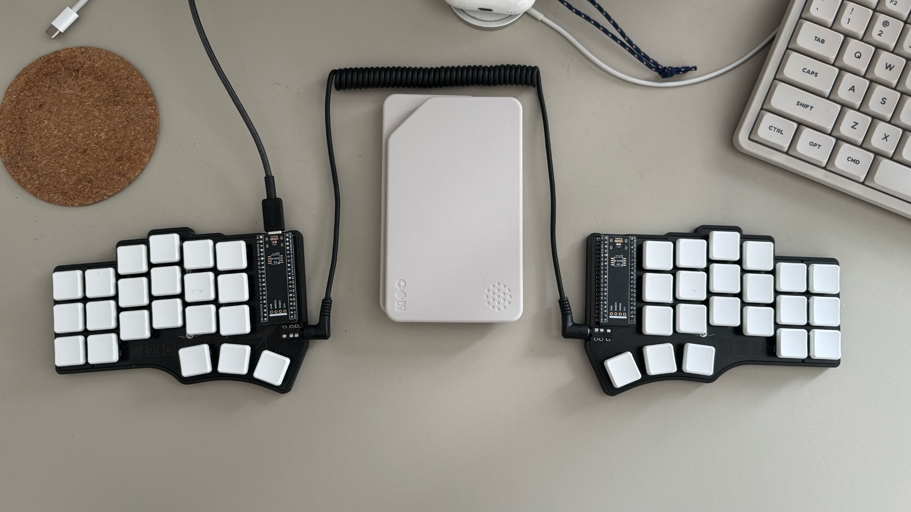

Я прочитал [одну статью][ugly_keyboards], и теперь моя клавиатура выглядит так (то, что в центре к клавиатуре не относится):

Знакомьтесь -- это [Cantor 42][cantor42]. Про все, связанные с ней нюансы, можно прочитать в упомянутой выше статье, я же хочу рассказать больше о процессе сборки и впечатлениях от использования. 

Вообще, я давно о чем-то таком подумывал, но меня всегда останавливала цена: стоимость такой клавиатуры в сборе обычно переваливает за [сотню-другую][prebuild] долларов, а если еще добавить доставку и таможню, то вполне может выйти и все 300. С учетом того, что я не был уверен, что мне "зайдет", предприятие всегда казалось черезчур дорогим и потому сомнительным. Но на этот раз я решил, что готов попробовать собрать клавиатуру сам: это так же ничего не гарантировало, но точно было в несколько раз дешевле, а еще обещало в два раза больше фана -- ведь придется еще и паять самому!

К тому же, оказалось, что можно собрать клавиатуру почти "из топора", нужны были только: печатные платы, контроллеры, свитчи, кейкапы, сокеты и проводки для соединения половинок -- согласитесь, не так много. Для такой клавы не нужен даже корпус -- хватит подставок, которые крепятся прямо к платам (но если очень хочется, то можно распечатать на 3d принтере и его).

В общем, мне показалось, что не так уж и страшно, так что можно попробовать.

### Печатные платы

Автор клавиатуры позаботился и составил несколько гайдов: [гайд по заказу печатных плат][pcb], и [гайд по сборке][build].

Через некоторое время после того, как я заказал печатные платы у JLCPCB, мне внезапно пришел вопрос к которому я был совсем не готов. Чуваки из JLCPCB уточняли про размер посадочных отверстий для свитчей, которые они не могли сделать такими, как было указано в дизайне, поэтому они хотели их увеличить. Альтернативой была перезаливка дизайна (к этому моменту отказаться от печати уже было нельзя). Я бросился спрашивать совета у всех знакомых, которые имели, по моему мнению, опыт в печати, на реддите и даже [завел багу в оригинальном репозе][bug]. В итоге, мне в нескольких местах посоветовали соглашаться на увеличение отверстий, что я и сделал. Результат, как мне показалось, никак особенно не сказался на монтаже свитчей: они встали плотно и нигде ничего не люфтит.

На всякий случай, если вдруг соберетесь менять толщину платы (дефолт 1.6mm), то учтите, что если будете делать корпус, то он может потребовать изменений. Например, я попросил знакомого отпечать мне [полукорпуса][halfcase] на 3д принтере, и мои платы встали в них очень ровно, но платы толще потребовали бы увеличения высоты бортиков -- я бы сразу на это внимание не обратил, и вероятно пришлось бы перепечатывать.

Остальные комплектующие я заказал на Али по списку из [описания к форку][fork]. Поскольку JLCPCB изготавливают платы количеством, кратным 5, я решил, что буду собирать сразу две клавиатуры, так что заказывал остальные комплектующие исходя из этого, например, свитчей я заказал аж 90 штук (2 x 42 + 6 про запас).

### Свитчи

Свитчи я выбрал Kailh Choc v1 brown -- у меня была до этого клавиатура с коричневыми свитчами, и мне нравится то, как они ощущаются (я пробовал и красные, и синии: вообще свитчей [очень много][switches], и тремя основными цветами они не ограничиваются). Chok я выбрал, потому что хотел клавиатуру с низким профилем: профили -- отдельная история, которую имеет смысл поизучать. Я не стал заказывать сокеты для горячей замены, и напаял свитчи прямо на плату: у меня была клавиатура с возможностью замены свитчей, но я менял их всего один раз (как раз когда пробовал синии), и больше не трогал, так что решил, что даже если какой-то свитч сгорит, то я его перепаяю. Сами же сокеты припаиваются к обратной стороне платы, что так же может повлиять на необходимость корпуса или его конструкцию.

### Пайка

Кстати, о пайке. Пайка это один из тех моментов, почему я все же решил попробовать собрать все сам. Последний раз я паял еще в школе (и даже ходил какое-то время в радио кружок), а несколько лет назад наткнулся на [канал, в котором чувак придумывает и паяет разные штуки][soldering], из которого узнал как поменялся мир паяльников с того времени. А поменялся он разительно: современные компактные паяльники (такие, как например, [MiniWare TS80P][iron], который я так же заказал на али), не только дают выбрать температуру, но еще и умеют эту температуру неплохо поддерживать (Гривер в своем обзоре хорошо показывает чем это может быть полезно). И, при всем этом, размером эти паяльники сравнимы если не с шариковой, то уж с некоторыми перьевыми ручками точно. В общем -- настоящий космос по сравнению с отцовским паяльником в моем детстве.

Про основы пайки у Алекса есть [отдельный видос][lesson] (и даже не один), но что мне кажется важным отметить -- это то, что вам вряд ли понадобится отельный флюс, и для того, чтобы спаять эту клавиатуру, должно хватить флюса, который уже содержится в припое.

### Кейкапы

Про кейкапы упомяну несколько вещей. Во-первых, если заказывать готовые, то стоит учитывать, что бывают варианты, которые называются "home" -- они отличаются от небольшие тактильными выступами (bumps), и предназначены для размещения на клавишах f/j, если вы не покупаете комплект капов без обозначения клавиш, то имеет смысл проверить входят ли в него такие варианты, и можно ли их заказать отдельно.

[ugly_keyboards]: https://oddsquat.org/posts/2026/ugly_keyboards_ru/
[cantor42]: https://github.com/diepala/cantor
[prebuild]: https://keebmaker.com/
[pcb]: https://github.com/diepala/cantor/blob/main/doc/pcb_ordering_guide.md
[build]: https://github.com/diepala/cantor/blob/main/doc/build_guide.md 
[fork]: https://github.com/freerer2/cantor-remix_MX
[bug]: https://github.com/diepala/cantor/issues/36
[halfcase]: https://www.printables.com/model/996711-cantor-mx-slim-case/files
[soldering]: https://www.youtube.com/@AlexGyverShow
[iron]: https://notenoughtech.com/review/miniware-ts80p/
[lesson]: https://www.youtube.com/watch?v=h9RTe8-vmxo
[switches]: https://geekboards.ru/page/mechanical_switches_v2
